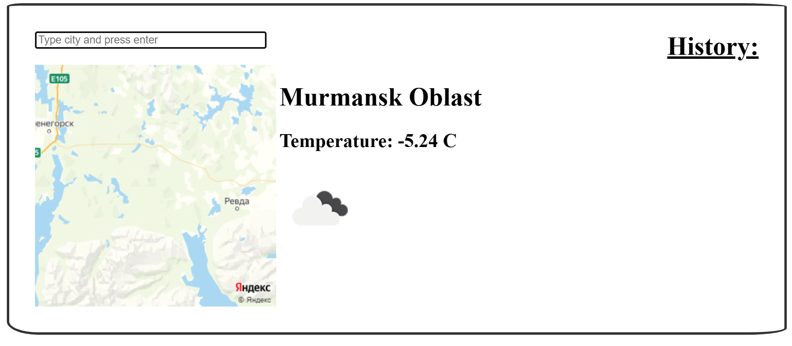
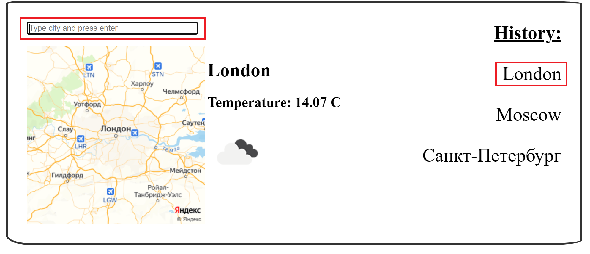
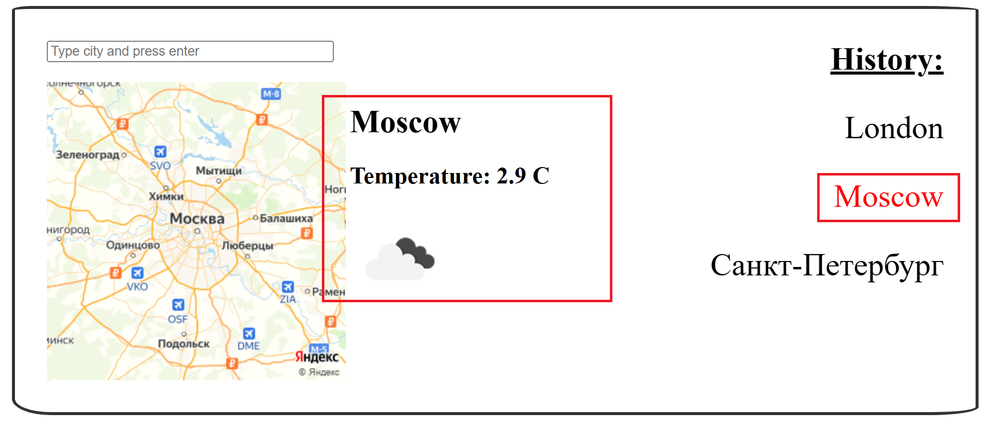

<br/>
<p align="center">
  <h3 align="center">Приложение "Прогноз погоды"</h3>
  <p align="center">
    Выполнение домашнего задания для лекции "Современный инструментарий при разработке клиентских (и не только приложений)"
    <br/>
    <br/>
  </p>
</p>

[](https://github.com/SergeyAkkuratov/OTUS_homework_lesson07/actions/workflows/pull_request_check.yml)
 

## Содержание

- [О проекте](#о-проекте)
- [Попробовать онлайн](#попробовать-онлайн)
- [Требования для локального запуска](#требования-для-локального-запуска)
- [Локальный запуск](#Локальный-запуск)
- [Использование](#использование)

## О проекте


Приложение "Прогноз погоды" это Web приложение разработанное на языке JavaScript. Оно предназначено для просмотра текущей погоды в конкретном городе.

Приложение показывает текущую температуру в градусах цельсия и общее состоянии погоды, обозначенное иконкой.

Так же приложение отображает компактную картинку с картой выбранного города.

Подробные инструкции для работы с приложением смотрите в разделе [Использование](#использование).

## Попробовать онлайн

Приложение запущено на GitHub Pages, так что вы можете опробовать его перейдя по [ссылке](https://sergeyakkuratov.github.io/OTUS_homework_lesson07/).

## Требования для локального запуска

Для того, чтобы запустить приложение локально, вам потребуется установить:

- Node.js и npm (через nvm) - воспользуйтесь официальной [инструкцией](https://github.com/nvm-sh/nvm).
- Git - [скачать](https://git-scm.com/downloads) и установить согласно инструкции.

## Локальный запуск

1. Склонировать репозиторий

```sh
git clone https://github.com/your_username_/Project-Name.git
```

2. Установить NPM пакеты

```sh
npm install
```

3. Запустить локальный сервер

```sh
npm run dev
```

## Использование

Приложение обладает следующими возможностями:

- При старте показывает карту и текущую погоду в городе, где вы находитесь



- Показывает карту и текущую погоду в указанном городе. Для этого нужно ввести название города в поле ввода и нажать клавишу Enter. Последние 10 названий городов попадают в колонку History.



- Показывает карту и текущую погоду в городе, на название которого кликнули в колонке History.

